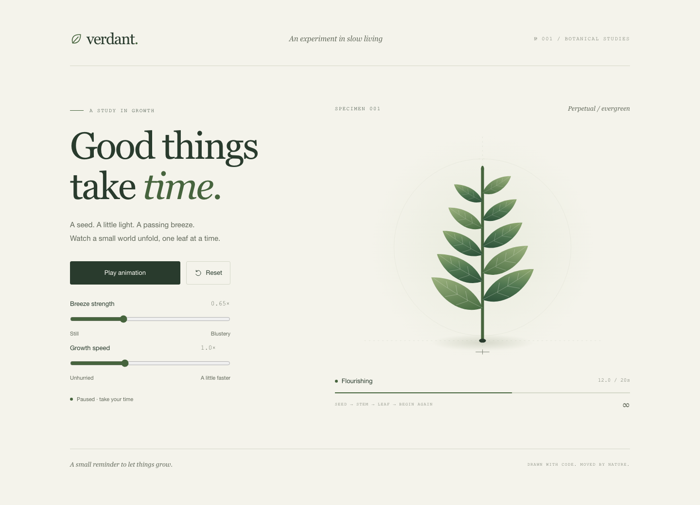

# Verdant — a study in growth

A quiet botanical demo: a stem grows, ten leaves sprout and unfurl, and a breeze moves them through damped springs. The plant fades back to its seed and grows again, forever.



## Features

- One portable `dist/index.html` containing compiled JavaScript, CSS, and SVG. Open it directly, even offline.
- Strict TypeScript source; no runtime libraries, external assets, fonts, or requests.
- Fixed 120 Hz physics, staggered leaf growth, adjustable wind and growth speed.
- A 20-second cycle at normal speed, with a smooth three-second fade back to the seed.
- Pause/resume, reset, keyboard controls, responsive layout, and a paused mature plant for reduced motion.
- Unit tests, Chromium smoke tests, and a Pages workflow with pinned action revisions.

## Setup

Use Node.js 22.22 or newer and npm.

```sh
npm ci
npx playwright install chromium
npm run dev
```

Open <http://127.0.0.1:4173>. Refresh after editing; the development server rebuilds on each page request. On Linux, browser installation may need `npx playwright install --with-deps chromium`.

```sh
npm run build
```

Open `dist/index.html` directly or upload that file to any static host. The source template is `src/index.html`; the deliverable is the built file. Build output is intentionally ignored.

## Controls

| Control                | Behavior                                                        |
| ---------------------- | --------------------------------------------------------------- |
| Pause / Play animation | Freezes or continues both growth and physics                    |
| Reset                  | Returns to the seed, preserving pause state and slider settings |
| Breeze strength        | 0–2×; zero lets existing spring motion settle                   |
| Growth speed           | 0.5–2×; a complete cycle takes 40–10 real seconds               |

Use Tab to navigate, Enter or Space on buttons, and arrow keys on sliders. The elapsed readout measures simulation time. Hidden tabs stop requesting frames; frame gaps longer than 100 ms are discarded instead of caught up. Motion can slow under heavy load. Reduced motion starts at a static mature plant; Play explicitly opts into animation. Enabling reduced motion while playing pauses it.

## Commands

| Command                | Purpose                                                     |
| ---------------------- | ----------------------------------------------------------- |
| `npm run dev`          | Serve locally and rebuild on refresh                        |
| `npm run build`        | Bundle to the self-contained `dist/index.html`              |
| `npm run format`       | Format source and documentation                             |
| `npm run format:check` | Verify formatting                                           |
| `npm run lint`         | ESLint: TypeScript, unused code, top-level imports          |
| `npm run typecheck`    | Strict TypeScript checks, including tests and build scripts |
| `npm test`             | Unit tests and production-artifact browser tests            |
| `npm run check`        | Formatting, lint, types, tests, and production build        |

Browser tests start their own server on port 4173; stop the dev server before running them.

## Architecture

| Module              | Responsibility                                              |
| ------------------- | ----------------------------------------------------------- |
| `src/config.ts`     | Typed parameters, supported bounds, timing, leaf geometry   |
| `src/growth.ts`     | Pure growth curves and lifecycle phases                     |
| `src/physics.ts`    | DOM-independent spring integration and wind field           |
| `src/simulation.ts` | Fixed-step accumulator, pause/reset, loop state             |
| `src/render.ts`     | SVG creation and projection of simulation state             |
| `src/controls.ts`   | Native controls, value labels, listener disposal            |
| `src/main.ts`       | Animation frame, visibility, reduced motion, page lifecycle |
| `src/style.css`     | Shared color, type, spacing, and motion tokens              |
| `scripts/`          | Build-time bundling and local HTTP server                   |

The stem follows a curved centerline. Each leaf has independent angle and unfurl springs. Semi-implicit Euler integration uses bounded substeps, damping, and velocity/position limits. At the cycle seam the plant has zero visible area; hidden spring state resets while the seed remains. The progress indicator intentionally wraps to zero. This is a stylized botanical illustration, not a biological or fluid dynamics model.

Listeners use abort signals. Pausing, hiding, or leaving the page cancels animation frames. Back-forward cache restoration resumes only when the user has not paused. No application timers or stored user data are used.

## Verification

Tests cover growth order, spring settling, pause/resume, reset, frame-rate agreement, loop boundaries, invalid inputs, and finite state across hundreds of cycles at supported extremes. Browser tests cover startup, keyboard interaction, reduced motion, uncaught errors, offline file loading, a repository subpath, and layouts at 320, 390, 768, and 1440 pixels. They also verify that the build contains only one HTML file and makes no external requests.

Chromium is the automated browser target. Firefox, Safari, physical mobile devices, and screen-reader behavior require manual verification. See [ACCESSIBILITY.md](ACCESSIBILITY.md).

## GitHub Pages

The production branch was detected from `origin/HEAD` as **main**. `.github/workflows/pages.yml` checks pull requests and pushes to `main`. After successful checks, pushes to `main` deploy the `dist` artifact. **Actions → Check and deploy → Run workflow → main** supports manual deployment through the same checks. Other branches can be checked manually but cannot deploy.

Repository setup:

1. In **Settings → Pages → Build and deployment**, select **GitHub Actions** as the source.
2. Ensure Actions are enabled and the pinned official actions are permitted.
3. Allow `main` to deploy to the `github-pages` environment. Configure required reviewers there if desired; reviewers must approve before deployment proceeds.
4. Push or manually run the workflow on `main`, then inspect the deployment job and open its reported URL.

The expected project URL is <https://hostlife22.github.io/audio-player--js/> unless a custom domain is configured. No root-relative asset paths or base-path configuration are needed. Do not treat the expected URL as evidence of a completed deployment. Deployment has not been verified from this workspace.

The workflow grants read-only repository access for checks and `pages: write` / `id-token: write` only to deployment. Pull requests cannot deploy. See GitHub's [custom Pages workflow documentation](https://docs.github.com/en/pages/getting-started-with-github-pages/using-custom-workflows-with-github-pages) for the required Pages setup.

## Repository metadata

Suggested description: **A calm, self-contained SVG plant animation with spring physics, written in strict TypeScript.**

Suggested topics: `typescript`, `svg`, `animation`, `spring-physics`, `generative-art`, `creative-coding`, `github-pages`, `no-dependencies`.

## Contributing and license

See [CONTRIBUTING.md](CONTRIBUTING.md), [SECURITY.md](SECURITY.md), and [ACCESSIBILITY.md](ACCESSIBILITY.md). MIT © 2026 Hostlife22 (repository author).
