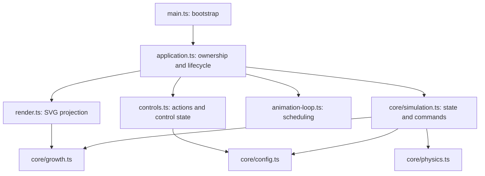

# Architecture

Verdant has two layers: a deterministic simulation core and browser adapters. The application is the single place that connects them. The build still produces one offline HTML file with no runtime dependencies.

## State ownership

`Simulation` owns mutable spring state, the fixed-step accumulator, and normalized parameters. Callers use `advance`, `reset`, `setPaused`, `setParameters`, and `showMature` to change them. Nested state and parameter getters expose read-only TypeScript contracts. These are live views for synchronous rendering, not frozen runtime objects or historical snapshots. Tests use `structuredClone` when comparing past state.

The core contains no DOM access, event listeners, timers, or imports from the browser layer. A separate TypeScript configuration excludes DOM and Node types to check this boundary. Leaf definitions and supported input limits live in core configuration; pixel coordinates belong to the SVG renderer. Parameter defaults flow from the simulation to controls on initial render.

## Browser responsibilities

- **Application:** creates and owns all resources. It routes control actions, handles reduced motion and page events, and synchronizes the view.
- **Controls:** binds native inputs to an explicit `ControlActions` interface. It receives normalized values for display. It does not import the simulation or renderer, and binding does not invoke callbacks during construction.
- **Renderer:** reads simulation state synchronously and updates SVG elements within its supplied root. It owns the leaf elements it creates and removes them on disposal.
- **Animation loop:** owns at most one pending frame. Its injected `FrameScheduler` lets unit tests advance time without a browser or real waits. It forwards elapsed time; fixed-step and long-frame policies belong to the simulation.
- **Bootstrap:** mounts the application. Other source modules can be imported without starting an animation.

## Lifecycle

Repeated `start()` calls keep the existing frame and clock baseline. Slider changes therefore do not restart the clock. `stop()` cancels pending work and clears the baseline. On resumption, the first frame contributes zero elapsed time; time spent suspended never advances the plant.

Pause is user intent in simulation state. Page visibility and back-forward-cache suspension are separate browser conditions; they stop scheduling without changing that intent. Restoring a page resumes only if it was playing. Enabling reduced motion pauses the simulation; disabling it does not automatically opt the user into motion.

`dispose()` is terminal and idempotent: it stops the loop, aborts listeners, and removes owned SVG leaves. A disposed frame loop cannot restart. A failing frame callback stops the loop and rethrows the error, keeping failures visible rather than scheduling repeated failures.

## Verification

- Existing numerical tests cover growth, springs, supported extremes, and frame-rate consistency across loop boundaries.
- Scheduler tests use a manual frame source to cover repeated start, cancellation, suspend/resume, repeated disposal, stopping inside a callback, and callback failure.
- Chromium tests cover controls, reduced motion, offline builds, responsive layouts, and synthetic `pagehide` / `pageshow` events. Synthetic events exercise our handlers; they do not certify browser-specific back-forward-cache eligibility.
- `npm run check` includes both application and DOM-free core type checks.

There is no global event bus, state framework, service container, or generic repository layer. The few interfaces describe real boundaries: controls, mounted application, and frame scheduling. Add a new boundary when a concrete behavior or test needs it.
